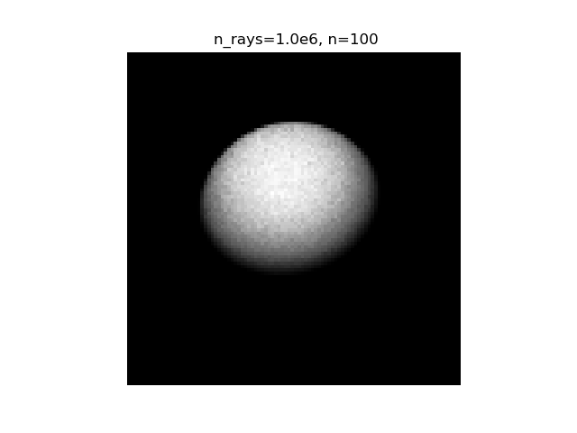
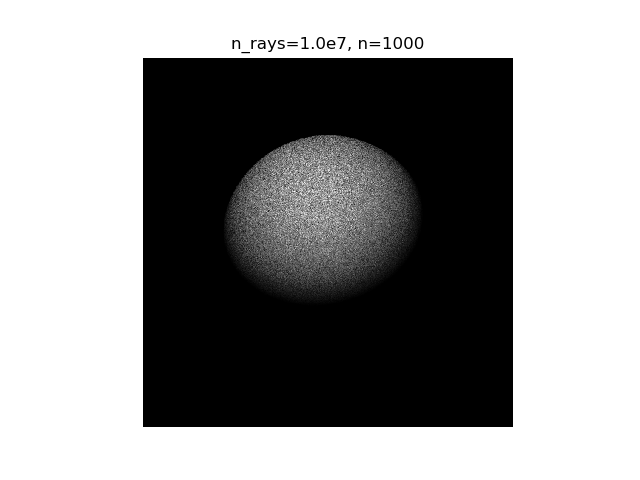
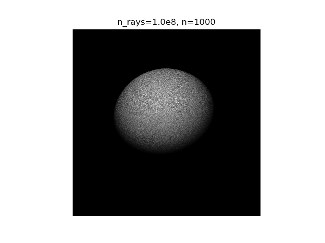

# Project 2

The code is used to generate the image of an object as seen by an observer looking through his window. The code asks user to provide input for n and Number of rays respectively and the remaining values have been assumed to be constant in the code. 

The graph generated for different values of n and Nrays are shown below:

## Code to execute

Below is the code to execute from the terminal

./executable 1000 1000000
